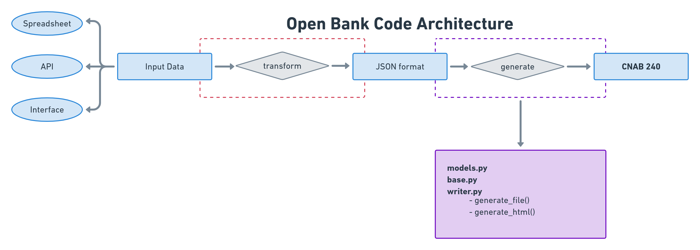

# CNAB Architecture with Pydantic
Date: 19-07-2021

## Status
- Accepted
- Amends [Typed Connectors Architecture](./0001_typed_connectors.md)
Deprecated [Typed Connectors Architecture](./0001_typed_connectors.md)

## Context

The product has the potential to be subject to different kinds of providers. While implementing a proof of concept of the architecture described in [0001](./0001_typed_connectors.md) we noticed that to add a new provider with this architecture, one would need:
- Create a provider according to the format of the input data.
- Write a handler that deals with the conversion between the provider and the CNAB model.

The consequence of this is that each new provider would require a new implementation of the integration with the CNAB model, meaning every provider would need to know what each line of the CNAB receives as inputs, besides how each input relates to the CNAB fields. This can only be achieved by checking in detail the [CNAB240 Specification](../Layout_padrao_CNAB240_V10_07-03_11_20.pdf).


## Decision
We decided to add a new layer of abstraction to make new providers unaware of the CNAB implementation. The providers are responsible for transforming the input data into a JSON format able to be used by our CNAB240 generator. This part of the system is represented by the red dashed line on the image below.



This new intermediary format is named Payroll, which contains all the necessary inputs and the mapping to the CNAB model.


File structure:
```
|- cnab/
    | - cnab240/
        | - base.py
        | - models.py
    | - payroll/
        | - models.py
|- providers/<provider>/
    | - models.py
    | - handler.py
```

## Models
### Intermediary Model
Sits between the entry data (regardless of provider) and the generated output. Each provider must implement a parser to transform their entry data to this format.

```python
from typing import List, Optional

from pydantic import BaseModel

class Company(BaseModel):
    bank_code: str
    registration_type: str
    registration_number: str

class Employee(BaseModel):
    bank_code: str
    bank_agency: str
    agency_check_digit: str
    name: str

class Payment(BaseModel):
    employee: Optional[Employee]
    company: Optional[Company]
    employee_name: str
    payment_amount: str
    payment_effective_date: str

class Payroll(BaseModel):
    company: Company
    employees: List[Employee]
    payments: List[Payment]

```


### CNAB Models
These models implement methods to transform data to the output format. They are responsible for generating the fixed-width file. Each field must have a specific length; each should be defined separately (unless for generic types like date or time fields, check digits, amounts, person name, and such). Each field should inherit or implement `.as_fixed_width`.

```python
# cnab/cnab240/base.py
from enum import IntEnum
from typing import ClassVar

from pydantic import BaseModel, constr, validator

class CNABString(BaseModel):
    _max_str_length: ClassVar[int] = 30
    __root__: constr(max_length=_max_str_length)

    def as_fixed_width(self):
        return self.__root__.ljust(self._max_str_length, " ")

class CNABPositiveInt(BaseModel):
    _max_str_length: ClassVar[int] = 3
    _min_int: ClassVar[int] = 1
    _max_int: ClassVar[int] = 999

    __root__: constr(max_length=_max_str_length)

    @validator("__root__")
    def validate_int(cls, value):  # noqa
        # Perform custom validation and return or
        # raise a ValidationError
        return value

    def as_fixed_width(self):
        return self.__root__.rjust(self._max_str_length, "0")

class CNABDate(BaseModel):
    _min_str_length: ClassVar[int] = 8
    _max_str_length: ClassVar[int] = 8

    __root__: constr(min_length=_min_str_length, max_length=_max_str_length)

    def as_fixed_width(self):
        return self.__root__

class CNABDecimal(BaseModel):
    _max_digits: ClassVar[int] = 8
    _decimal_places: ClassVar[int] = 2

    __root__: constr(max_length=_max_digits)

    def as_fixed_width(self):
        return self.__root__

class BankCode(CNABString):
    _max_str_length: ClassVar[int] = 2
    __root__: constr(max_length=_max_str_length)

class BankAgencyNumber(CNABString):
    _max_str_length: ClassVar[int] = 9999
    __root__: constr(max_length=_max_str_length)

class PersonName(CNABString):
    _max_str_length: ClassVar[int] = 50
    __root__: constr(max_length=_max_str_length)

class NomeEmpresa(CNABString):
    _max_str_length: ClassVar[int] = 50
    __root__: constr(max_length=_max_str_length)

```

```python
# cnab/cnab240/models.py
from typing import List

from pydantic import BaseModel, Field

from cnab.cnab240.v10_7 import lambdas
from example.cnab.cnab240.base import (
    BankAgencyNumber,
    BankCode,
    CNABDate,
    CNABDecimal,
    CNABString,
    PersonName,
)

class BaseConfig:
    allow_population_by_field_name = True

    @classmethod
    def alias_generator(cls, field: str) -> str:
        if field not in cls._mapping:
            return field
        return cls._mapping[field]

class HeaderCNAB(BaseModel):
    field_01_0: BankCode
    field_02_0: CNABString = Field(default_factory=lambdas.get_field_G016)
    field_03_0: CNABString = Field(default_factory=lambdas.get_field_G016)
    field_17_0: CNABDate = Field(default_factory=lambdas.get_field_G016)

    class Config(BaseConfig):
        _mapping: dict = {
            "field_01_0": "bank_code",
            "field_05_0": "registration_type",
            "field_06_0": "registration_number",
        }


    def __init__(self, payroll: Payroll) -> None:
        super().__init__(payroll.company.dict())

class BatchDetailSegmentA(BaseModel):
    field_01_3A: BankCode
    field_09_3A: BankCode
    field_10_3A: BankAgencyNumber
    field_15_3A: PersonName
    field_20_3A: CNABDecimal
    field_22_3A: CNABDate

    _mapping: dict = {
        "field_01_3A": "company.bank_code",
        "field_09_3A": "employee.bank_code",
        "field_10_3A": "employee.bank_agency",
        "field_15_3A": "employee.name",
        "field_20_3A": "payment.payment_amount",
        "field_22_3A": "payment.payment_effective_date",
    }

    def _map_values(self, initial_data: dict) -> None:
        data = {}
        for key, nested_path in self._mapping.items():
            [entity_key, field_key] = nested_path.split(".")

            entity = initial_data[entity_key]
            data[key] = getattr(entity, field_key)

        return data

    def _get_payment_employee_info(self, payroll, employee_name):
        for employee in payroll.employees:
            if not employee_name == employee.name:
                continue
            return employee

    def __init__(self, payroll: Payroll, payment: Payment) -> None:
        employee = self._get_payment_employee_info(payroll, payment.employee_name)
        company = payroll.company

        initial_data = {
            "payment": payment,
            "company": company,
            "employee": employee,
        }
        data = self._map_values(initial_data)
        super().__init__(**data)


class CNABFile(BaseModel):
    header: HeaderCNAB
    batch_detail_segment_a: List[BatchDetailSegmentA]

```

### Provider models
There will be one model for each data provider. These models are responsible for ensuring the entry data follows a pre-defined structure. In this case, for spreadsheets, we also have a mapping from the spreadsheet column names to the one expected by the intermediary model.


```python
# connectors/spreadsheet/models.py
from typing import List, Optional
from pydantic import BaseModel

class BaseConfig:
    allow_population_by_field_name = True

    @classmethod
    def alias_generator(cls, field: str) -> str:
        if field not in cls._mapping:
            raise Exception()
        return cls._mapping[field]

class SpreadsheetCompany(BaseModel):
    bank_code: str
    registration_type: str
    registration_number: str

    class Config(BaseConfig):
        _mapping = {
            "bank_code": "* Código do Convênio no Banco",
            "registration_type": "* Tipo de Inscrição da Empresa",
            "registration_number": "* Número de Inscrição da Empresa",
        }

class SpreadsheetEmployee(BaseModel):
    bank_code: str
    bank_agency: str
    agency_check_digit: str
    name: str

    class Config(BaseConfig):
        _mapping = {
            "bank_code": "Código do Banco do Favorecido",
            "bank_agency": "* Ag. Mantenedora da Cta do Favor.",
            "agency_check_digit": "* Dígito Verificador da Agência",
            "name": "Nome do Favorecido",
        }

class SpreadsheetPayment(BaseModel):
    employee_name: str
    payment_amount: str
    payment_effective_date: str

    class Config(BaseConfig):
        _mapping = {
            "employee_name": "Funcionário",
            "payment_amount": "Valor do Pagamento",
            "payment_effective_date": "Data Real da Efetivação Pagto",
        }

class SpreadsheetPayroll(BaseModel):
    company: SpreadsheetCompany
    employees: List[SpreadsheetEmployee]
    payments: List[SpreadsheetPayment]

    class Config(BaseConfig):
        _mapping = {
            "company": "empresa",
            "employees": "funcionarios",
            "payments": "pagamentos",
        }
```

### Provider handlers
There will be one handler for each data provider. Handlers are responsible for instantiating CNABFile model, in practice the handler would only need to pass the data to the CNABFile with not need to know how to map inputs to fields. Every handler should implement a `get_cnab_file` method.

*Obs: Details of this implementation can be updated to make the file generation more generic.

```python
# handlers.py
from cnab.cnab240.models import BatchDetailSegmentA, CNABFile, HeaderCNAB
from cnab.payroll.models import Payroll
from providers.spreadsheet.models import SpreadsheetPayroll
from providers.spreadsheet.utils import get_spreadsheet_data


class SpreadsheetHandler:
    def __init__(self, filename):
        spreadsheet_data = get_spreadsheet_data(filename)
        self.spreadsheet_payroll = SpreadsheetPayroll.parse_obj(spreadsheet_data)
        self.payroll = Payroll.parse_obj(self.spreadsheet_payroll.dict())

    def get_cnab_file(self):
        header = HeaderCNAB.parse_obj(self.payroll)

        lote_detalhe_a = []
        for payment in self.payroll.payments:
            lote_a = BatchDetailSegmentA(payroll=self.payroll, payment=payment)
            lote_detalhe_a.append(lote_a)

        cnab_data_format = CNABFile(
            header=header,
            lote_detalhe_segmento_a=lote_detalhe_a
        )

        return cnab_data_format
```

### Closing thoughts we still need to address:
- Optional fields like all fields specified by `lote_detalhe_segmento_c`.
- Custom fields. They should live in the same classes as the regular fields and not be dealt with separately
- Lambda functions should be kept to make their meaning more clear, simple default values cause too much confusion.


## Consequences
- New providers would only need to create a provider model with the correct mapping and a simple handler.
- Implementation of the provider is unaware of the CNAB file.
