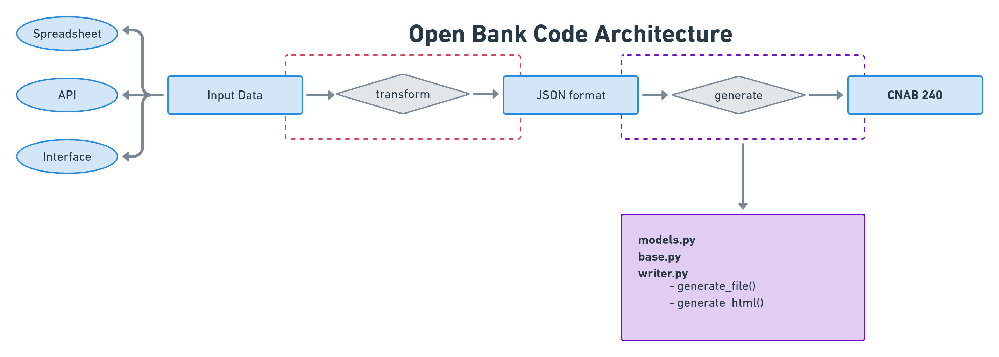

# [RFC] Typed Connectors Architecture

The connectors are responsible for transforming the input data into a JSON format able to be used by our CNAB240 generator. This part of the system is represented by the red dashed line on the image below.

 
## Context
We are using this as a learning opportunity. We intend to put to the test new tools and learn with them. `pydantic` is one of these tools; we will use it as the data parser and validator while exploring type hints. The intention is to replicate the structure of models and serializers to assure proper parsing, validation with readable code. 

- **Why pydantic?** Enforces type hints at runtime with friendly validations, plus is being widely used by the community. 
- **Why type hints?** Type hints are new language features that we want to experiment with. 
- **Why replicate the model/serializer structure?** Separation of concerns and extensibility. 

The requirements for the connectors are:
- One must easily add a new data provider to generate the CNAB240 file.
- The part of the library that generates the CNAB240 should be unaware of the connectors.


## Decision
Use `pydantic` to enforce type hints and validations and generate the JSON schema to be used by the CNAB 240 generator. The components of this architecture are **formaters** and **validators**. 

File structure:
```
|- cnab/cnab240/
    | - models.py
|- connectors/<provider>/
   |- models.py
   |- handler.py
   |- mapping.py
```

### Models
There will be a single class to mount and format the output JSON. This class is the **general** mapping between the data and the CNAB240 generator. All connectors should use this class to create the output JSON.  

```python
from typing import ClassVar, List
from enum import IntEnum
from pydantic import BaseModel, constr, validator
from pydantic.types import condecimal

class CNABString(BaseModel):
    _max_str_length: ClassVar[int] = 30
    __root__: constr(max_length=_max_str_length)

    def as_fixed_width(self):
        return self.__root__.ljust(self._max_str_length, " ")

class CNABPositiveInt(BaseModel):
    _max_str_length: ClassVar[int] = 3
    _min_int: ClassVar[int] = 1
    _max_int: ClassVar[int] = 999

    __root__: constr(max_length=_max_str_length)

    @validator("__root__")
    def validate_int(cls, value):
        # Perform custom validation and return or
        # raise a ValidationError
        return value

    def to_fixed_width(self):
        return self.__root__.rjust(self._max_str_length, "0")

class CNABDate(BaseModel):
    _min_str_length: ClassVar[int] = 8
    _max_str_length: ClassVar[int] = 8

    __root__: constr(min_length=_min_str_length, max_length=_max_str_length)

    @validator("__root__")
    def validate_date(cls, value):
        # Perform custom validation and return or
        # raise a ValidationError
        return value

    def to_fixed_width(self):
        return self.__root__

class CNABDecimal(BaseModel):
    _max_digits: ClassVar[int] = 8
    _decimal_places: ClassVar[int] = 2

    __root__: constr(max_digits=_max_digits)

    @validator("__root__")
    def validate_decimal(cls, value):
        # Perform custom validation and return or
        # raise a ValidationError
        return value

    def to_fixed_width(self):
        return self.__root__

class TipoInscricaoEnum(IntEnum):
    insento = 0
    cpf = 1
    cnpj = 2
    pis = 3
    outros = 9

class CodigoBanco(CNABString):
    _max_str_length: ClassVar[int] = 3
    __root__: constr(max_length=_max_str_length)

class DigitoVerificador(CNABString):
    _max_str_length: ClassVar[int] = 1
    __root__: constr(max_length=_max_str_length)

class NumeroAgenciaBancaria(CNABString):
    _max_str_length: ClassVar[int] = 9999
    __root__: constr(max_length=_max_str_length)

class NomeEmpresa(CNABString):
    _max_str_length: ClassVar[int] = 50
    __root__: constr(max_length=_max_str_length)

class HeaderCNAB(BaseModel):
    field_01_0: CodigoBanco
    field_05_0: TipoInscricaoEnum
    ...
    field_13_0: NomeEmpresa

class LoteDetalheSegmentoA(BaseModel):
    field_01_3A: CodigoBanco
    field_09_3A: CodigoBanco
    field_10_3A: NumeroAgenciaBancaria
    field_11_3A: DigitoVerificador
    ...
    field_20_3A: CNABDecimal
    field_22_3A: CNABDate

class CNABFile(BaseModel):
    header: HeaderCNAB
    lote_header: LoteHeaderCNAB
    lote_detalhe_segmento_a: List[LoteDetalheSegmentoA]
    lote_detalhe_segmento_b: List[LoteDetalheSegmentoB]
    lote_detalhe_segmento_c: List[LoteDetalheSegmentoC]
    lote_trailer: LoteTrailerCNAB
    trailer: TrailerCNAB
```

### Provider models
There will be one model for each data provider. These models are responsible for ensuring the entry data follows the defined format:

```python
# connectors/spreadsheet/models.py
class Company(BaseModel):
    pass

class Employees(BaseModel):
    pass

class Payments(BaseModel):
    pass

class SpreadSheet(BaseModel):
    company: Company
    employees: List[Employees]
    payments: List[Payments]
```

### Provider handlers
There will be one handler for each data provider. Handlers are responsible for parsing the entry data to a CNABFile instance. Every handler should have its own `get_cnab` method. 

```python
# handlers.py
from connectors.spreadsheet.mapping import MODELS_SPREADSHEET_MAP
from cnab.cnab240.models import CNABFile, HeaderCNAB, LoteDetalheSegmentoA
from spreadsheet_handler import get_spreadsheet_data


class SpreadsheetHandler:
    def __init__(self):
        spreadsheet_data = get_spreadsheet_data()
        self.spreadsheet = SpreadSheet(company=...)

    def get_cnab(self):
        header_dict = {}
        for info in MODELS_SPREADSHEET_MAP["header"].values():
            sheet_name = info["sheet_name"]
            column_name = info["column_name"]
            empresa_info = spreadsheet.company
            header_dict[empresa_info["target_name"]] = empresa_info[column_name]
        header_input = HeaderCNAB(**header_dict)

        lote_detalhe_a = []
        for pagamento_info in spreadsheet_data["Pagamentos"]:
            line = {}
            for info in MODELS_SPREADSHEET_MAP["lote_detalhe_segmento_a"].values():
                sheet_name = info["sheet_name"]
                column_name = info["column_name"]

                if sheet_name == "Empresa":
                    info = spreadsheet_data[sheet_name]
                elif sheet_name == "Pagamentos":
                    info = pagamento_info
                elif sheet_name == "Funcionário":
                    # filtering by name
                    info = spreadsheet_data["Funcionário"][pagamento_info["Funcionário"]]
                else:
                    raise Exception

                attr = info["target_name"]
                column_value = info[column_name]
                line[attr] = column_value

            lote_detalhe_a_input = LoteDetalheSegmentoA(**line)
            lote_detalhe_a.append(lote_detalhe_a_input)


        cnab_data_format = CNABFile(
            header=header_input.map_to_cnab_fields(),
            lote_detalhe_segmento_a=[detalhe_a.map_to_cnab_fields() for detalhe_a in lote_detalhe_a],
        )

        return cnab_data_format
```

## Consequences
- We need to create a default mapping to serve as an example for newcomers adding connectors with the fields and their required info.
- We need to change `spreadsheet_map` to be something like:
```json
{
  "header": {
    "field_01_0": {
      "name": "Código do Banco na Compensação",
      "params": {"sheet_name": "Empresa"},
      "origin_name": "* Código do Convênio no Banco",
      "target_name": "codigo_convenio_banco"
    }
  }
}
```
- The `writer.py` will need updates to use this new format.
- We need to consider that fields can be optional like all fields specified by `lote_detalhe_segmento_c`.
- Custom fields will need to be migrated for this new pattern. They should live on the same classes as the regular fields and not be dealt with separately, lambda functions should be replaced by default values or classes.
